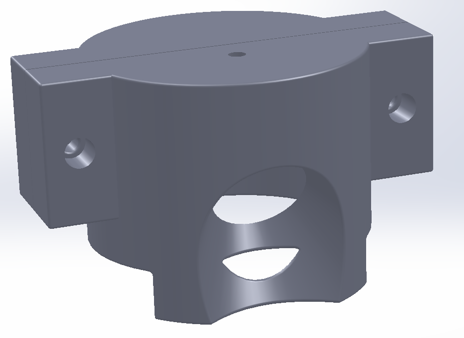

# sawyer_kinect2_mounting

This repository contains CAD file as well as the STL files for the supporting structure to mount Kinect v2 on top of Sawyer Robot. The default setting of screws' diameter is 6mm.

The structure looks like this:

